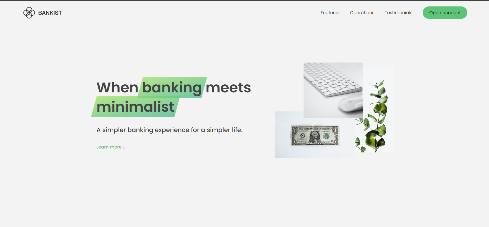

# Advanced Bankist App

An enhanced banking application built using **HTML5**, **CSS3**, and **JavaScript (ES6+)**.  
This project builds on the original Bankist app from Jonas Schmedtmann’s [*The Complete JavaScript Course* on Udemy](https://www.udemy.com/course/the-complete-javascript-course/) and introduces new features, an improved UI/UX, and modern code practices.

> **Disclaimer**: All rights to the original course content belong to Jonas Schmedtmann. This repository is for **personal and educational** purposes only. For any use beyond personal study, please refer to Jonas Schmedtmann’s guidelines or seek permission.

---

## Table of Contents

1. [Overview](#overview)
2. [Features](#features)
3. [Tech Stack](#tech-stack)
4. [Installation](#installation)
5. [Usage](#usage)
6. [Screenshots](#screenshots)
7. [Project Structure](#project-structure)
8. [Contributing](#contributing)
9. [License](#license)

---

## Overview

The **Advanced Bankist App** offers a full-fledged banking experience with:

- Enhanced authentication and error handling  
- Real-time balance updates and transaction history  
- A modern, responsive, and animated UI  
- Improved code architecture with ES6 modules and best practices

This version refines the original implementation by adding more robust features and a smoother user experience.

## Features

- **Enhanced Authentication:**  
  Secure login/logout functionality with improved error handling.

- **Real-Time Updates:**  
  Instant balance and transaction history updates to simulate a dynamic banking environment.

- **Advanced Transactions:**  
  Perform money transfers, request loans, and close accounts with a streamlined workflow.

- **Modern UI/UX:**  
  Responsive design with smooth animations, optimized for both desktop and mobile.

- **Modular Codebase:**  
  Code refactored using ES6 modules for improved readability and maintenance.

---

## Tech Stack

- **HTML5**: Markup structure  
- **CSS3**: Styling, animations, and responsive design  
- **JavaScript (ES6+)**: Application logic and interactivity  
- *(Optional: List any additional tools or libraries used, e.g., Webpack, Babel, etc.)*

---

## Installation

1. **Clone the Repository:**
   ```bash
   git clone https://github.com/jibrilMaygag/advanced-bankist-app.git
   ```
2. **Navigate to the Project Directory:**
   ```bash
   cd advanced-bankist-app
   ```
3. **Open `index.html`:**  
   Simply double-click the file or run a local server (e.g., using VSCode Live Server).


---

## Usage

- **Login:**  
  Use the provided mock credentials to log in.

- **Dashboard:**  
  View your updated balance and transaction history.

- **Transactions:**  
  Transfer money, request loans, or close accounts using the refined user interface.

- **Real-Time Feedback:**  
  Enjoy immediate updates to your actions, thanks to enhanced interactivity.


## Screenshots

<p align="center">  </p>

---

## Project Structure

```
advanced-bankist-app/
│
├── index.html          # Main HTML file
├── css/                # Stylesheets folder
│   └── style.css
├── js/                 # JavaScript files folder
│   ├── main.js         # Main JavaScript file
├── README.md           # This file
└── screenshots/        # Folder for screenshots
```

---

## Contributing

Contributions are welcome! To contribute:

1. **Fork the repository.**
2. **Create a feature branch:**
   ```bash
   git checkout -b feature-name
   ```
3. **Commit your changes:**
   ```bash
   git commit -m "Add new feature"
   ```
4. **Push to the branch:**
   ```bash
   git push origin feature-name
   ```
5. **Open a Pull Request for review.**

---

## License

This project is based on the original Bankist app from Jonas Schmedtmann’s *The Complete JavaScript Course* on Udemy.  
All rights to the original content belong to Jonas Schmedtmann.  
This advanced version is for **personal and educational** purposes only.

For further use or distribution, please refer to Jonas Schmedtmann’s guidelines or seek permission from the original author.


Thank you for checking out the **Advanced Bankist App**!  
If you encounter any issues or have suggestions, please feel free to open an issue.
